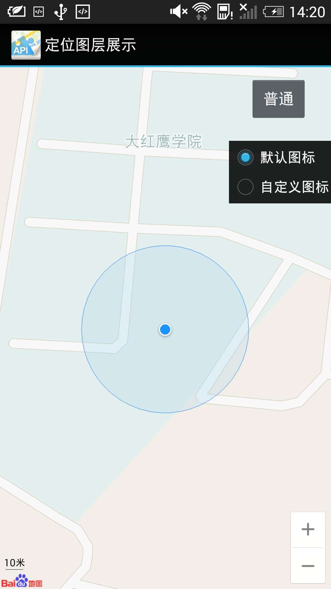
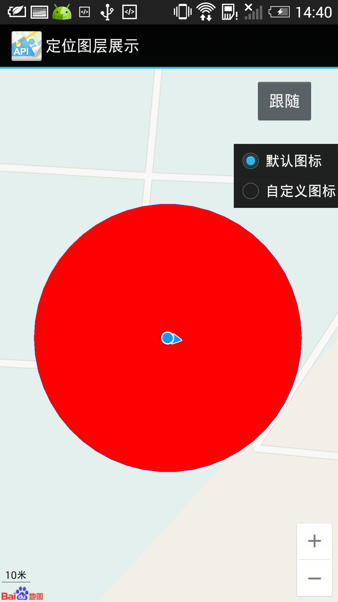
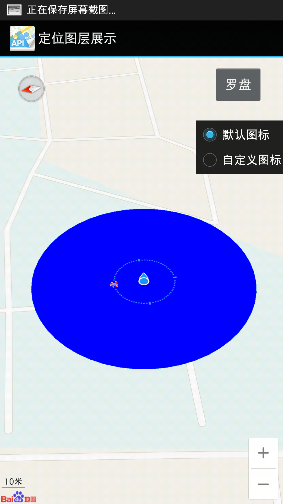
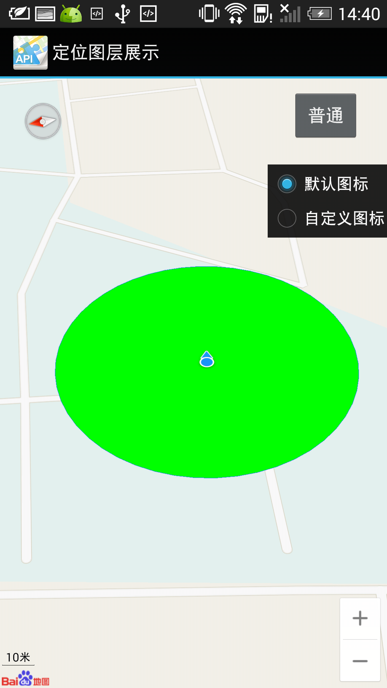
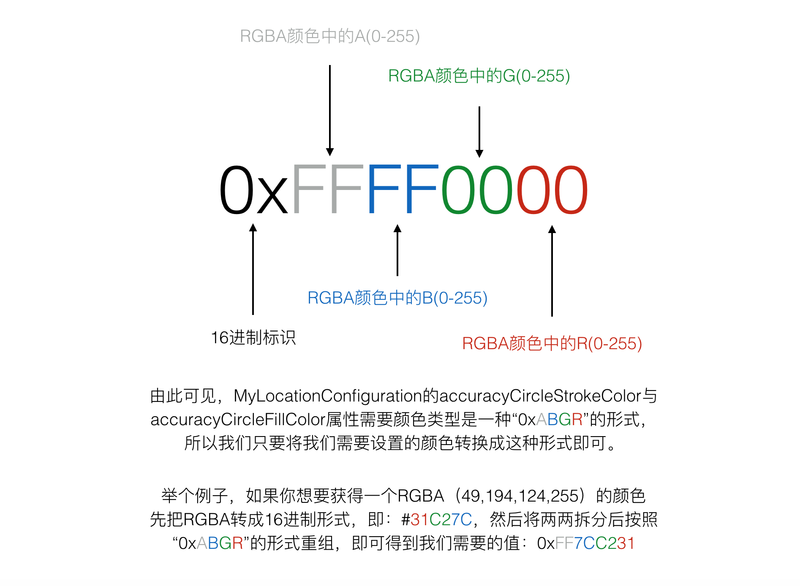

如何正确设置 MyLocationConfiguration 的 accuracyCircleStrokeColor 与 accuracyCircleFillColor 属性的颜色值

Android开发中，经常用到地图定位服务，百度地图api正提供了这样的服务，然而客户需求的效果和api自带的样式不尽相同，那么就需要我们就行一些定制化操作了。

<!--more-->

如下图，百度地图api默认提供了蓝色的外边框（accuracyCircleStrokeColor），淡蓝色的内部填充（accuracyCircleFillColor）


因为客户的需求是修改填充部分颜色，接下来我们通过代码来修改内部填充色：

设置填充色为红色

```
	MyLocationConfiguration confit = new MyLocationConfiguration(LocationMode.FOLLOWING, true, mCurrentMarker);
	// 红色
	confit.accuracyCircleFillColor = 0xFF0000FF;
	mBaiduMap.setMyLocationConfigeration(confit);
```

设置后，运行效果如下：


设置填充色为蓝色

```
	MyLocationConfiguration confit = new MyLocationConfiguration(LocationMode.COMPASS, true, mCurrentMarker);
	// 蓝色
	confit.accuracyCircleFillColor = 0xFFFF0000;
	mBaiduMap.setMyLocationConfigeration(confit);
```

设置后，运行效果如下：


设置填充色为绿色

```
	MyLocationConfiguration confit = new MyLocationConfiguration(LocationMode.COMPASS, true, mCurrentMarker);
	// 绿色
	confit.accuracyCircleFillColor = 0xFF00FF00;
	mBaiduMap.setMyLocationConfigeration(confit);
```

设置后，运行效果如下：


到此，颜色修改成功！accuracyCircleStrokeColor与accuracyCircleFillColor的设置方式一样。
可是问题来了，小伙伴们会说，这个颜色的值要怎么设置呢。这个“0xFF0000FF”，“0xFFFF0000”，“0xFF00FF00”都是怎么来的呢？接下来就来回答这个问题。
我们首先会想到的解决方式是去点进 MyLocationConfiguration 的类里面去查看有没有相关方法或是提示。
在 MyLocationConfiguration 中我们发现了 accuracyCircleFillColor 和 accuracyCircleStrokeColor 被设置了默认值（其实我们会发现这两个分别是构造默认的蓝色边框和淡蓝色填充需要用到的值）
```
	public int accuracyCircleFillColor = 4521984;
	public int accuracyCircleStrokeColor = 4653056;
```
还有一个比较重要的`a`方法（真想吐槽这个方法名）：
```
	private int a(int var1) {
		int var2 = (var1 & -16777216) >> 24;
		int var3 = (var1 & 16711680) >> 16;
		int var4 = (var1 & '\uff00') >> 8;
		int var5 = var1 & 255;
		int var6 = Color.argb(var2, var5, var4, var3);
		return var6;
	}
```
在 MyLocationConfiguration 其中的两个个构造方法中，我们会发现api都调用了`a`方法给accuracyCircleFillColor和accuracyCircleStrokeColor重新设值（下面给出了其中一个构造的代码）
```
	public MyLocationConfiguration(MyLocationConfiguration.LocationMode var1, boolean var2, BitmapDescriptor var3) {
		if(var1 == null) {
			var1 = MyLocationConfiguration.LocationMode.NORMAL;
		}
		this.locationMode = var1;
		this.enableDirection = var2;
		this.customMarker = var3;
		this.accuracyCircleFillColor = this.a(this.accuracyCircleFillColor);
		this.accuracyCircleStrokeColor = this.a(this.accuracyCircleStrokeColor);
	}
```

不难发现，`a`方法在构造颜色中起了很重要的作用，算法好的同学们，可能很容易推测验证出`a`方法的作用。我在这里也不深究`a`方法如何构造出需要的颜色。下面我通过一张说明图来解释如果构造自己需要的颜色。


Now, all is OK...


欢迎关注我的个人微信订阅号，我将不定期分享开发方面的干货。


